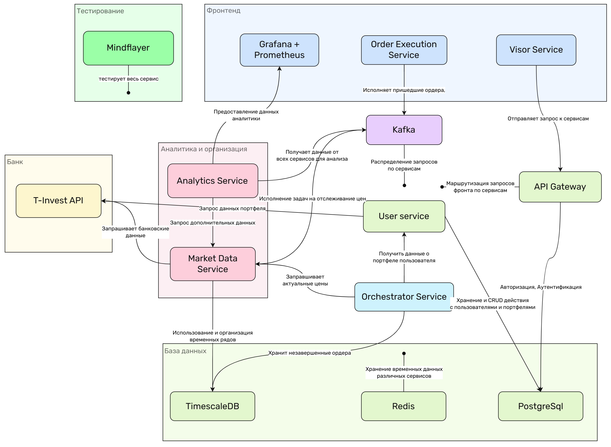
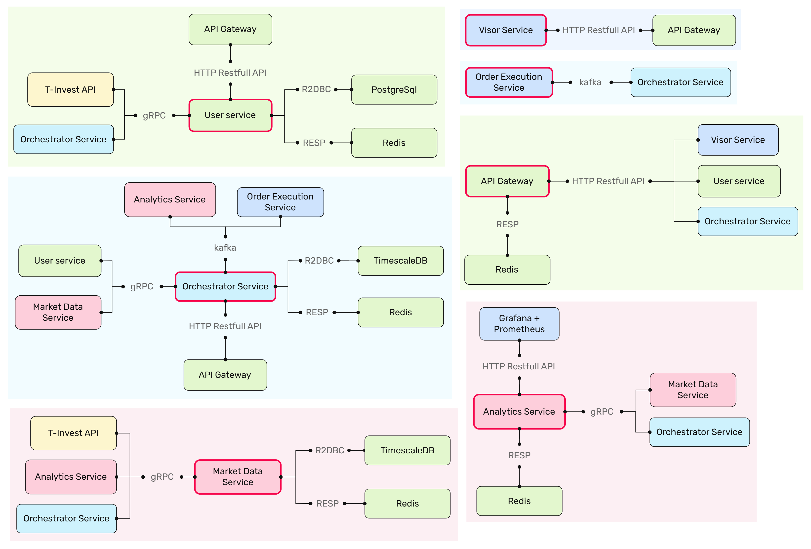
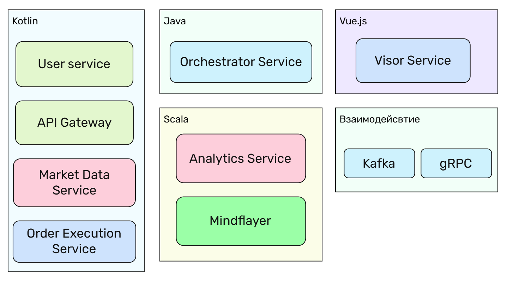
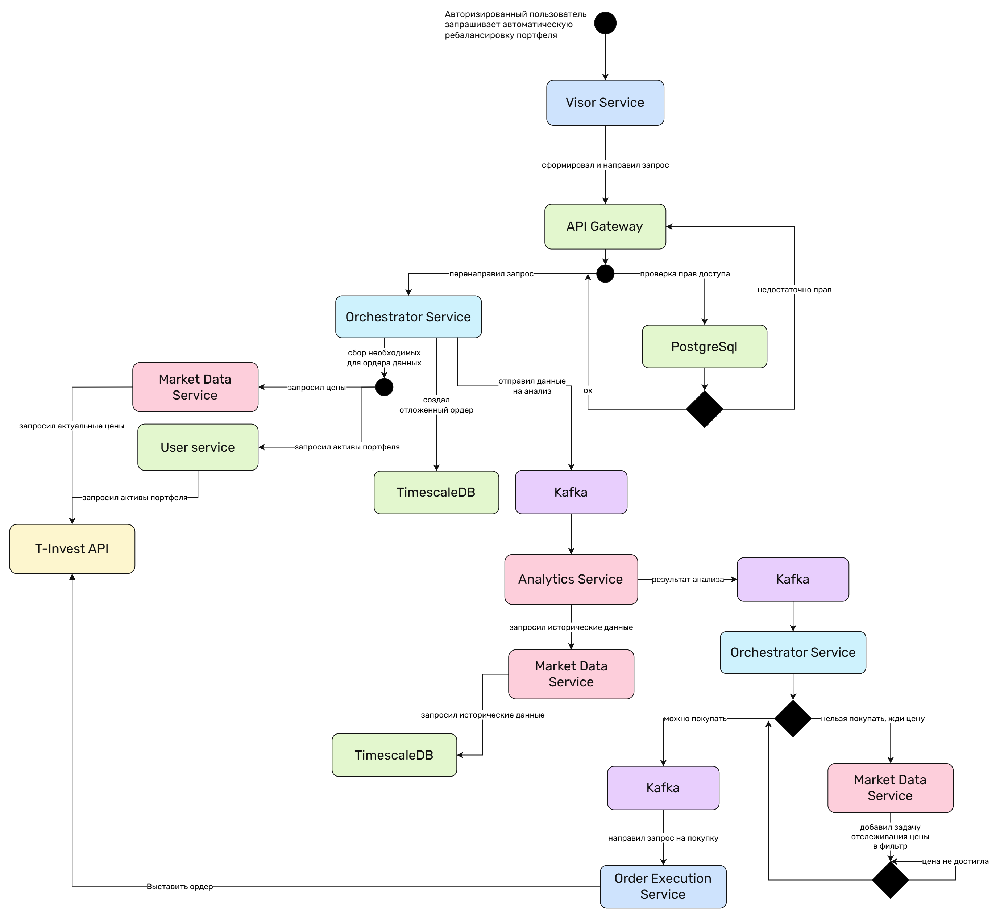

    
  
<em>Общая структура сервисов</em>

    
  
<em>Связь сервисов по протоколам</em>

    
  
<em>Основные технологии для сервисов</em>

    
  
<em>Базовый пример автоматической ребалансировки</em>

